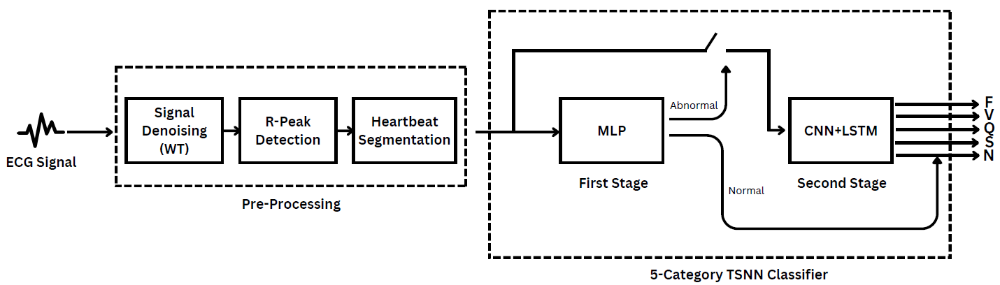

# ECG Classification using Neural Networks

This repository contains the implementation of a two-stage neural network architecture for ECG classification, 
developed as part of the bachelor thesis project. The system is designed to classify heartbeats into normal and abnormal categories, 
and further classify abnormalities into specific types.

## Table of Contents
- [Introduction](#introduction)
- [Project Overview](#project-overview)
- [Technologies Used](#technologies-used)
- [Key Features](#key-features)
- [Results](#results)
- [Acknowledgments](#acknowledgments)

## Introduction
This project proposes a monitoring system for real-time ECG classification using machine learning models. 
It is designed to enhance cardiovascular anomaly detection by employing a two-stage architecture with computational efficiency, making it suitable for edge devices.

## Project Overview

1. **Data Preprocessing**:
   - Utilized the MIT-BIH Arrhythmia Database.
   - Preprocessing steps included noise reduction, R-peak detection, and heartbeat segmentation.
   - Addressed class imbalance using the SMOTE technique to ensure reliable training.

2. **Two-Stage Neural Network**:
   - **Stage 1**: A Multi-Layer Perceptron (MLP) for binary classification (Normal vs. Abnormal heartbeats).
   - **Stage 2**: A CNN-LSTM model for multi-class classification to identify specific types of abnormalities.

3. **Overall Accuracy Calculation**:
   - Combined the results of both stages to compute an overall system accuracy.

## Technologies Used
- Python 3.x
- TensorFlow/Keras
- NumPy and Matplotlib for data handling and visualization
- SMOTE for class balancing

## Key Features
- **Binary Classification**: Efficient detection of normal and abnormal heartbeats.
- **Multi-Class Classification**: Further classification of abnormalities into five categories based on the AAMI standard.
- **Performance Metrics**: Evaluation using metrics like accuracy, sensitivity, specificity, and F1-score.
- **Optimized Computation**: Reduced parameters and enhanced efficiency for edge-device compatibility.

## Results
- **Binary Classifier (MLP)**:
  - Accuracy: 99.91%
  - Sensitivity: 99.98%
  - Specificity: 99.69%
  - F1-Score: 99.94%

- **Multi-Class Classifier (CNN-LSTM)**:
  - Accuracy: 99.88%
  - Sensitivity: 99.88%
  - Specificity: 99.97%
  - F1-Score: 99.88%

## Acknowledgments
- **Supervisors**: Prof. Dr. Tallal Elshabrawy, Prof. Dr. Maggie Mashaly
- **Co-Supervisor**: MSc. Ing. Fatma Hassan

## Download Bachelor Thesis
- You can download the complete bachelor thesis here:
- [Download Thesis PDF](Alaa_ShamsEldin_Thesis.pdf)
